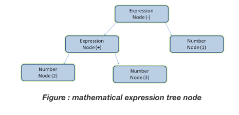

# How_Browsers_Work
[こちらの記事](https://www.html5rocks.com/en/tutorials/internals/howbrowserswork/)を読んで整理したもの

## Introduction
オープンソースブラウザである Firefox, Chrome, Safari を対象に話をする。
HTML ファイルの解釈・表示に関する仕様は [World Wide Web Consortium (W3C)](https://www.w3.org/) によって管理されている。
ブラウザの UI は仕様には規定されていないが、多くのブラウザは類似の機能を持っている。

### ブラウザの上位構造
1. The user interface
アドレスバーや、戻る／進むボタン、ブックマークなど、メインウィンドウ（ページが表示される領域）を除くすべての部分
2. The browser engine
UI とレンダリングエンジンの間の処理
3. The rendering engine
HTML, CSS を解析し、コンテンツを画面に表示
4. Networking
5. UI backend
プラットフォームに依存しない汎用的なインターフェース
6. JavaScript interpreter
JavaScript の解析と実行
7. Data storage
永続的なレイヤ


## The rendering engine
レンダリングエンジンは HTML と XML、画像を表示可能。
プラグインや拡張を通してその他のデータも表示可能となる。

Firebox:			Gecko
Safari:			WebKit
Chrome, Opera:	Blink (a fork of WebKit)

コンテンツを 8kB のチャンクに分け、以下の順で処理する
1. HTML の解析、DOM の構成
2. DOM tree 構造のレンダー
HTML とともに CSS や style 要素も解析され、 render tree を生成
3. render tree の配置
各ノードに画面で表示されるべき座標が割り当てられる
4. render tree の描画 
render  tree が走査され、UI バックエンドレイヤを使用して各ノードが 描画される

レンダリングエンジンは UX を考慮して可能な限り早くコンテンツを画面上に表示しようとする。そのため、HTML の解析を待ってから tree の構築とレイアウトを開始するわけではない。 


Gecko には content sink と呼ばれる、DOM 要素を作成するための追加のレイヤーがある。

## Parsing and DOM tree construction
解析は、ドキュメントをコードが実行できる形に変換すること。解析結果はノードのツリー構造になり、 parse tree や syntax tree と呼ばれる。

2 + 3 - 1 の式を解析すると以下のようになる。



この例では、下記の条件を用いる。
**Vocabulary:**
整数、プラス記号、マイナス記号

**Syntax:**
1. 構成要素は式、項、演算
2. 式をいくつでも含めることができる
3. 式は、項に続いて演算、さらに別の項が続いたもの
4. 演算は + または -
5. 項は整数か式

ルールに最初に一致するのは  `2` で #5 に該当する。二番目に該当するのは `2 + 3` で #3 、次の一致は `2 + 3 - 1`  となる

解析は、ドキュメントが従う構文ルールに基づいて行われる。
解析は字句解析（lexical analysis）と構文解析（syntax analysis）のプロセスからなる。字句解析では入力を単語に分割する。構文解析は言語の構文ルールを適用する。
lexer には空白文字や改行など、関係ない文字を除外する機能がある。


解析は反復処理で、parser が lexer にトークンを要求し、構文と付き合わせる。トークンがルールに一致した場合に、トークンに対応するノードが parse tree に追加される。
ルールが一致しない場合はトークンを内部的に格納しておき、内部に格納したトークンに一致するルールが見つかるまでトークンの要求を行う。ルールが見つからない場合は syntax error として例外を発生させる。

parse tree は最終成果物でないことが多い。例えばコンパイルでは、解析して parse tree を生成したのち、機械語に変換する。


パーサーには「トップダウンパーサー」と「ボトムアップパーサー」の二種類がある。
トップダウンパーサーは上位構造から走査する。一方、ボトムアップパーサーは入力を調べて、構文ルールに変換する。下位のルールから開始し、上位のルールが一致するまで続ける。

parser を生成するツールとして parser generator がある。WebKit では Flex（lexer を生成）と Bison（parser を生成）を使用。

### HTML Parser
HTML はミスに寛容な姿勢をとっているため、従来のパーサーでは簡単に解析することはできない。解析処理中の入力変更（document.write など）も、簡単ではない理由の一つ。
HTML における parse tree は DOM 要素と属性のノードからなる tree である。DOM は、HTML document や外部（JavaScript など）とのインターフェースを表現している。 tree の root は Document オブジェクト。

```html
<html>
  <body>
    <p>
      Hello World
    </p>
    <div> </div>
  </body>
</html>

```

の DOM は、以下のように表すことができる。


解析アルゴリズムは tokenization と tree construciton で構成される。
tokenization は字句解析で、加えて開始・終了タグや属性名とその値がトークンとして含まれる。tokenizer はトークンを認識すると tree constructor に渡して次の文字を処理する。これを入力の最後まで続ける。


トークン化アルゴリズムは[こちら](https://www.html5rocks.com/en/tutorials/internals/howbrowserswork/#The_tokenization_algorithm)
ツリー構築アルゴリズムは[こちら](https://www.html5rocks.com/en/tutorials/internals/howbrowserswork/#Tree_construction_algorithm)

解析が終了した際、ブラウザはドキュメントを interactive とみなし、 deffered mode のスクリプトの解析を開始する。ドキュメントの状態は「完了」に設定され、読込イベントが開始される。

ブラウザは無効なコンテンツを集英して処理を続けるため、Invalid Syntax が発生することはない。

WebKit のエラー許容の例は下記のとおり。
* <br> の代わりに </br> を用いる
	* <br> のように扱う
* テーブルが他のテーブルの中に存在するが、セルの中にない
	* 内側のテーブルを取り出し、同等のテーブル2つに変更する
* <form> タグを別の <form> の中に配置する
	* 2番目の form を無視する
* タグ階層が深すぎる
	* 同じ種類のタグは20階層までを許容する
* html や body タグの配置ミス

### CSS parsing
CSS は HTML とは異なり、文脈自由文法（context free grammar）である。

WebKit では Flex, Bison parser generator を使用している。Bison はボトムアップ型の shift-reduce parser を使用、Firebox では手動で記述された都ップダウンパーサーを使用している。どちらの場合でも、 CSS ファイルは StyleSheet object に変換される。


### スクリプトとスタイルシートの処理順序
ドキュメントの解析はスクリプトが実行されるまで中断される。スクリプトが外部にある場合は、ネットワークからリソースを取得する必要がある。この処理も同期的に行われるため、リソースが取得されるまで解析は中断される。defer attribute をスクリプトに加えることで、ドキュメントの解析を中断せず、解析後にスクリプトを実行することができる。
また、HTML5 ではスクリプトを非同期にするオプションが追加された。

WebKit, Firefox ともに最適化を行っている。スクリプトの実行中に、別のスレッドでドキュメントの残りを解析し、ネットワークから読み込む必要のあるリソースを探して読み込む。これにより、リソースの読み込みが並列化されることで全体の速度が向上する。（Speculative parsing）
Speculative parsing では、DOM tree は変更しない。外部リソースへの参照のみを解析し、処理はメインパーサーに委ねる。

スタイルシートは理論的には DOM tree を変更しないため、ドキュメントの中断を必要とする理由はないように思える。しかしスクリプトがスタイルの情報を要求するケースがあるため問題になりうる。そのため、Firefox では読み込みや解析中のスタイルシートが存在する場合、スクリプトをブロックする。一方 WebKit では、スクリプトがスタイルプロパティにアクセスしようした場合のみ、スクリプトをブロックする。

## Render tree construction
DOM tree を構築する間に、ブラウザは render tree も構築する。これは視覚的な要素で、正しい順序でコンテンツを画面に描画することを目的としている。
各 renderer は CSS box に相当する矩形の領域を表しており、幅・高さ・位置などの情報を含んでいる。
ボックスの種類は display スタイル属性に影響される。

renderer は DOM 要素に対応するが必ずしも 1 対 1 ではない。視覚的ではない DOM 要素（head 要素や、 display=“none” の要素など）は render tree には追加されない。（visibility 属性が hidden の要素はツリーには含まれる）
DOM 要素が複数の視覚オブジェクトに対応する場合がある。例えば select 要素は display area, drop down list box, button の 3 renderer を持つ。
また、DOM ノードに対応するが、 tree の場所が異なる場合もある。float や absolute の属性を持つ場合である。


tree 構築のフローについて、Firebox ではプレゼンテーションが DOM 更新の listener として登録される。プレゼンテーションはフレームの作成をコンストラクターに委譲し、コンストラクタガス体wるを解決してフレームを作成する。
WebKit では、attachment と呼ばれる処理でスタイルを解決して renderer を作成する。各 DOM ノードは attach メソッドを持ち、新しく追加された場合には新しいノードの attach メソッドが呼び出される。
html タグと body タグを処理すると render tree の root が構築される。root render object は containing block と呼ばれる他のブロックを包括する最上位のブロックに相当する。

render tree を構築するには各オブジェクトの視覚的プロパティを計算する必要がある。（各要素のスタイルプロパティを計算する）

スタイルシートとして、下記のものがある。
* ブラウザ標準のスタイルシート
* ページ作成者のスタイルシート
* ユーザーのスタイルシート
	* ブラウザのユーザーが用意したスタイルシートで、ブラウザ機能のお気に入りのスタイルなどを指す

スタイルの計算には問題点がある。
* スタイルデータが大きな構造体であるためメモリ問題
* 要素ごとのマッチングルール探索におけるパフォーマンス問題
* ルールの改装を定めた複雑な cascade rules の適用問題

これらに対して、ブラウザがどのように対処しているかを一部抜粋する。

### マッチ容易性のためのルール操作
要素自身にスタイル属性がある場合、要素をキーとして簡単に HTML 属性にマッピングが可能。
```html
<p style="color:blue" />	// inline style attributes
<p bgcolor="blue" />		// HTML visual attributes
```

一方、CSS rules のマッチングは複雑に成ることがある。そのため、スタイルシートの解析後、セレクタに従ってハッシュマップのいずれかにルールが追加される。ハッシュマップには、下記のものがある。
* id 別
* クラス名別
* タグ名別
* いずれにも該当しない一般的なもの

```css
p.error { color: red }		// => class map
#messageDiv { height: 50px }	// => id map
div { margin: 5px }			// => tag map
```

対象の HTML が、下記の場合を考える。
```html
<p class="error">an error occurred </p>
<div id=" messageDiv">this is a message</div>
```

この場合、p 要素は class map を、div 要素は id map と tag map をチェックする。WebKit、Firefox ともにこの操作を行なっている。

### スタイルシートのカスケード順序
カスケード順序は低い順に、以下の通り。
1. ブラウザの宣言
2. ユーザーの通常の宣言
3. ページ作成者の通常の宣言
4. ページ作成者の important 宣言
5. ユーザーの important 宣言

同じ順序の宣言は、Specificity に基づいて判断される。

### Specificity（特異性）
定義は以下の通り。
* セレクタ付きのルールではなく、style 属性にある場合は 1、そうでない場合は 0 とカウント（=a）
* セレクタ内の ID 属性の数をカウント（=b）
* セレクタ内の他の属性と擬似クラスの数をカウント（=c）
* セレクタ内の要素名と擬似要素の数をカウント（=d）

```css
 *             {}  /* a=0 b=0 c=0 d=0 */
 li            {}  /* a=0 b=0 c=0 d=1 */
 li:first-line {}  /* a=0 b=0 c=0 d=2 */
 ul li         {}  /* a=0 b=0 c=0 d=2 */
 ul ol+li      {}  /* a=0 b=0 c=0 d=3 */
 h1 + *[rel=up]{}  /* a=0 b=0 c=1 d=1 */
 ul ol li.red  {}  /* a=0 b=0 c=1 d=3 */
 li.red.level  {}  /* a=0 b=0 c=2 d=1 */
 #x34y         {}  /* a=0 b=1 c=0 d=0 */
 style=""          /* a=1 b=0 c=0 d=0 */
```

優先度は a > b > c > d

WebKit では段階的に処理をおこなう。上位レベルのスタイルシートが読み込まれたかのフラグを持っており、完全に読み込まれていない場合は、仮の情報を持っておき、スタイルシートが読み込まれると再計算する。

## Layout
renderer を作成し、tree に追加した状態では renderer は位置やサイズを持っていない。これらを計算することをレイアウトもしくはリフローと呼ぶ。
レイアウトは、ドキュメント左から右へ、上から下へすすむ。座標系は root フレームに対して相対的で、top / left の座標が用いられる。
root  renderer の位置は (0, 0) で、ブラウザウィンドウの表示領域分の view port を保持する。

小さな変更に対して全体のレイアウト処理を行わなくても済むように、dirty / children are dirty のフラグを持つ。dirty bit system と呼ばれ、レイアウト処理が必要な箇所のみを管理する。

font-size が変更されたり、画面サイズが変わった場合は全体のレイアウトを開始する。これを “global” レイアウトと呼ぶ。
一方、dirty な renderer のみをレイアウトすることを “incremental” レイアウトと呼ぶ。ネットワークから新しい renderer が DOM tree に追加された場合などに発生する。

global layout は通常同期的に、 incremental layout は非同期的に行われる。
スタイル情報（例: offsetHeight）を要求するスクリプトの処理では incremental layout でも同期的に行われうる。

リサイズや renderer の位置が変わったことによるレイアウト処理の場合、レンダーサイズは再計算せずにキャッシュから取得する。sub tree に変更があった場合はレイアウトは root から開始されない場合もある。テキストフィールドへのテキストの挿入など、変更が局所的 な場合を指す。これを最適化と呼ぶ。

### レイアウト処理
通常パターンは下記の通りとなる。
1. 親 renderer が自身の幅を決定する
2. 親が子を確認して、
	1. 子 renderer を配置する（x, y を設定）
	2. 必要な場合、子のレイアウト処理を呼び出す（子の高さを計算する）
3. 親はこの累積した高さ、余白（margin / padding）を使用して自身の高さを設定する
4. dirty bit を false にする

renderer の幅は、コンテナブロックの幅、renderer の width プロパティの値、margin や border から計算される。
WebKit では次の形で計算する。
```
clientWidth() - paddingLeft() - paddingRight()
```

ここで得られるのは**望ましい幅**である。
望ましい幅が最大幅より大きい場合は最大幅が、最小幅より小さい場合は最小幅が使用される。

レイアウト中に改行が必要だと判断した場合、レイアウトを中断して親に改行の必要があることを伝える。親は別の renderer を作成して layout メソッドを呼び出す。

## Painting

## Dynamic changes

## The rendering engine’s threads

## CSS2 visual model